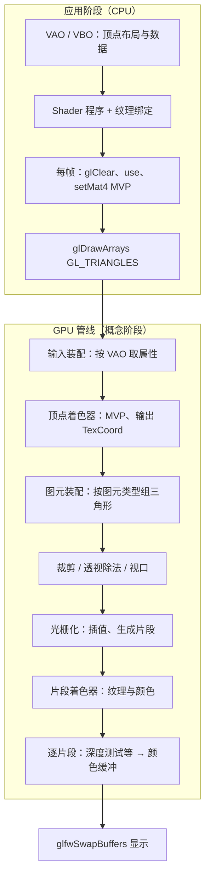

# Lesson 5：渲染管线（结合 `lesson5_1.cpp`）

本文用 **Lesson 5.1 坐标系统** 的示例程序，把 OpenGL 从 **CPU 准备数据** 到 **窗口显示** 的路径串成一条 **渲染管线**，并标出与本课源码、着色器的对应关系。

---

## 1. 一句话总览

**CPU** 把顶点放进 VBO、用 VAO 描述如何读取、绑定纹理、设置 uniform（MVP）、调用 `glDrawArrays`；**GPU** 依次执行：读顶点 → 顶点着色器 → 图元装配 → 裁剪与视口 → 光栅化 → 片段着色器 → 深度测试等 → 写入帧缓冲；最后 **GLFW** 交换缓冲把图画到屏幕上。

---

## 2. 流程图（逻辑顺序）

---

## 3. 应用阶段（CPU）：在 `glDrawArrays` 之前

| 做什么 | 本课代码中的体现 |
|--------|------------------|
| 顶点数据在显存里 | `glBufferData` 把 `vertices` 上传到 **VBO** |
| 告诉 GPU「每个顶点长什么样」 | **VAO** + `glVertexAttribPointer`：location 0 为位置，1 为纹理坐标 |
| 可执行着色器 | `Shader`，链接着色器得到程序对象 |
| 纹理 | `loadTexture` / `createProceduralTexture`，`glActiveTexture` + `glBindTexture` |
| 采样器与纹理单元 | `setInt("texture1", 0)` 等，对应片段着色器里的 `sampler2D` |
| 每帧清屏与深度 | `glClear`，本课开启 `GL_DEPTH_TEST` |
| 变换矩阵 | `setMat4("projection" / "view" / "model", ...)` |
| 发起绘制 | `glBindVertexArray(VAO)` 后 `glDrawArrays(GL_TRIANGLES, 0, 36)` |

**要点**：CPU 不「算像素」，只准备资源和 **绘制命令**；真正按管线跑的是 GPU。

---

## 4. VAO 与 VBO：区别与各自作用

二者分工不同，通常 **配合使用**，不是二选一。

### 4.1 VBO（Vertex Buffer Object，顶点缓冲对象）

- **是什么**：一块在 **GPU 上的内存**，存放 **顶点原始数据**（位置、纹理坐标、法线等，可交错排列成一个数组）。
- **作用**：把 CPU 里的 `vertices` 等数据 **`glBufferData` 上传到显存**，绘制时 GPU 从这里 **读字节**。
- **不做什么**：VBO 只存数据，**不说明**「几个 float 算一个属性、步长多少、对应顶点着色器哪个 `location`」——这些由 **顶点属性指针状态** 描述（而该状态在 Core Profile 下由 **VAO** 记录）。

**本课**：`glBindBuffer(GL_ARRAY_BUFFER, VBO)` 后 `glBufferData(..., vertices, ...)` 即把立方体顶点写入当前 VBO。

### 4.2 VAO（Vertex Array Object，顶点数组对象）

- **是什么**：不是第二份顶点拷贝，而是 **一组 OpenGL 状态的集合**，记录 **如何从当前绑定的 VBO（及可选的 EBO）里，把数据接到各个顶点属性上**。
- **典型会记下**：每个 `glVertexAttribPointer`（分量数、类型、是否归一化、**stride**、相对 VBO 起点的 **offset**）、哪些 `glEnableVertexAttribArray` 已启用、（若使用）**元素数组缓冲 EBO** 的绑定。
- **作用**：**打包顶点输入布局**；之后 `glBindVertexArray(VAO)` 即可恢复整套解释方式，不必每帧重复设置指针。在 **OpenGL 3.3 Core** 下，绘制时一般需要 **绑定有效 VAO**。

**本课**：location **0** = 位置 3 个 float，location **1** = 纹理坐标 2 个 float，**stride** = `5 * sizeof(float)`，这些配置在 **绑定该 VAO 时** 通过 `glVertexAttribPointer` / `glEnableVertexAttribArray` 写入 VAO。

### 4.3 对比小结

| | **VBO** | **VAO** |
|---|---------|---------|
| **存什么** | 顶点 **数据**（显存里的字节流） | **如何解读** 数据（属性格式 + 启用哪些属性 + 可选 EBO） |
| **比喻** | 装满数字的练习册 | 目录说明：第几列是位置、第几列是 UV |

### 4.4 与本课代码的配合顺序

1. `glBindVertexArray(VAO)`（先绑 VAO，后续顶点状态会记进这个 VAO）。  
2. `glBindBuffer(GL_ARRAY_BUFFER, VBO)`，`glBufferData` 上传数据。  
3. `glVertexAttribPointer` + `glEnableVertexAttribArray` 指定与 `5.1.coordinate_systems.vs` 中 `layout (location = 0/1)` 对应的布局。  
4. 绘制：`glBindVertexArray(VAO)` → `glDrawArrays(...)`；**输入装配** 按 VAO 的规则从 VBO 取数，送入顶点着色器。

**一句话**：**VBO = 数据仓库；VAO = 取货说明与属性开关清单。**

---

## 5. GPU 管线：阶段说明（与本课的关系）

### 5.1 输入装配（Input Assembly）

根据当前绑定的 **VAO**，从 **VBO**（及索引缓冲，本课未用 EBO）里取出每个顶点的属性，作为顶点着色器的输入。

- 本课：`aPos`、`aTexCoord` 对应 `5.1.coordinate_systems.vs` 里的 `layout (location = 0/1) in ...`。

### 5.2 顶点着色器（Vertex Shader）

对每个顶点执行一次。

- 本课文件：`engine/src/lesson/lesson5/5.1.coordinate_systems.vs`
- 核心：`gl_Position = projection * view * model * vec4(aPos, 1.0)`，完成 **局部 → 世界 → 观察 → 裁剪空间**。
- 同时把 `aTexCoord` 写到 `out TexCoord`，供后续阶段使用（会在光栅化时被插值）。

### 5.3 图元装配（Primitive Assembly）

**没有**对应的 C++ 函数；由 **绘制命令里的图元类型** 决定如何把「顶点流」收成图元。

- 本课：`glDrawArrays(GL_TRIANGLES, 0, 36)` 表示按顺序 **每 3 个顶点组成 1 个三角形**，36 个顶点共 12 个三角形（一个立方体的一个 draw）。
- 发生位置：**GPU 上、顶点着色器之后**，在裁剪等步骤之前。你把图元类型告诉 OpenGL，驱动在 GPU 上完成装配。

### 5.4 裁剪、透视除法、视口变换

在 **裁剪空间** 做裁剪，然后做透视除法（`gl_Position` 的 `w`），再映射到 **帧缓冲像素** 坐标。本课一般不写单独代码，由 OpenGL 按当前视口等状态处理。

### 5.5 光栅化（Rasterization）

把三角形覆盖到的 **像素位置** 变成 **片段（fragment）**；顶点着色器输出的 `TexCoord` 等在三角形内部 **线性插值**，传给片段着色器。

### 5.6 片段着色器（Fragment Shader）

对每个片段执行（可通过深度测试等提前丢弃）。

- 本课文件：`engine/src/lesson/lesson5/5.1.coordinate_systems.fs`
- 核心：用插值后的 `TexCoord` 采样 `texture1`、`texture2`，`mix` 得到 `FragColor`。

### 5.7 逐片段操作（Per-Fragment Operations）

包括 **深度测试**、模板测试、混合等。本课启用了深度测试：`glEnable(GL_DEPTH_TEST)`，并与 `glClear(... | GL_DEPTH_BUFFER_BIT)` 配合，决定前后遮挡关系。通过测试的片段写入 **颜色缓冲**（及深度缓冲）。

---

## 6. 显示

`glfwSwapBuffers(window)` 交换前后台缓冲，把已绘制好的图像显示在窗口中。

---

## 7. 与本课循环的对应（多个立方体）

`lesson5_1.cpp` 里对 10 个立方体做循环：每次只改 **`model`** 再 `glDrawArrays`。含义是：

- **VBO/VAO 相同**：每次都是同一套局部空间顶点；
- **每次 draw 走完整条 GPU 管线**：顶点着色器用新的 `model` 算新的 `gl_Position`，再装配、光栅化、片段着色器等。

因此不是「一条管线画十个立方体」，而是 **十次 draw，十次管线执行**（可并行化由驱动/GPU 决定，逻辑上仍是十次）。

---

## 8. 延伸阅读（同目录其它笔记）

- `多个VAO和VBO的使用.md`：多组 VAO/VBO 时的绑定与切换。
- `如何渲染多个立方体.md`：多实例与模型矩阵的配合。
- `为什么36个顶点能渲染10个立方体.md`：顶点数与 draw 次数的关系。

更简要的管线提纲也写在 `lesson5_1.cpp` 文件顶部注释中，可与本文对照阅读。
